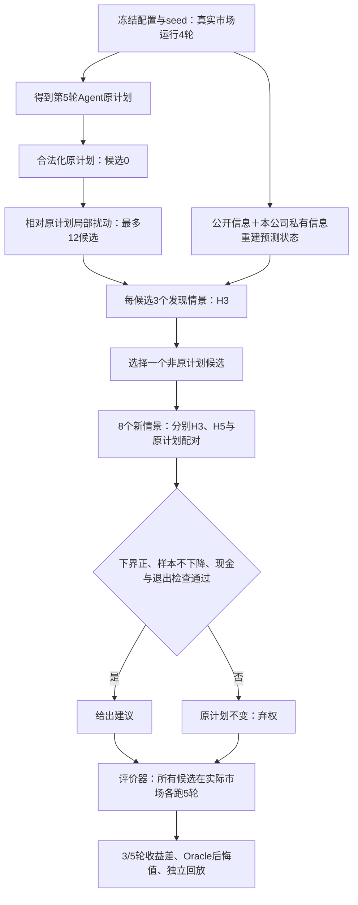

# v19 完整执行 Trace 与逐例分析

本文件提供实际输入、动作、候选评分、验证、市场结算与审计记录，不是模型内部思维链。本轮为规则Agent与模拟器实验，新增真实LLM调用0次；没有可提供的本轮真实模型回答或采用/拒绝过程。

## 一、先看结论

原计划接入、时序隔离、保存恢复和合作协议误记违约的问题已修复；“所有市场稳定改善”没有修复到验收通过。利润18/18分组通过，福利7/18；720源状态中三轮下降24例、五轮下降28例。28个五轮负例均通过过模型内H3/H5验证。因此，模型内正下界不能当成实际经营保证。

条件响应相对同池纯搜索的三轮额外收益为-245.49合成元，95%种子配对bootstrap区间[-675.27,117.29]；没有证明增加该模块提高经营收益。分类Brier按观测行汇总较低，但按8个独立种子比较的区间仍跨零；也不能据此声称响应已可靠。

## 二、完整记录在哪里

- [原始全量证据包（4158文件）](../releases/reliable-advisor-v19.0.0/evidence.zip)：720正式源状态及3个开发样本、三种建议结果、所有候选实际动作/指标/逐轮状态hash、1080主制度案例与两批历史修补前案例、120规模、45敏感性、校准、预注册与验收。不要把历史修补批次计为新增独立主样本。
- [720例索引](../artifacts/reliable-v19-trace/all-720-cases-index.json)：每个状态的市场、人数、目标、seed、初始hash、原文件SHA256和三种建议结果。
- [28例负收益汇总](../artifacts/reliable-v19-trace/negative-cases-summary.json)：逐轮收益、福利分项、原计划/建议动作与模型内下界。
- 每个 `negative-cases/*.json.gz` 包含该案例的原始完整记录、全部候选的逐轮完整市场状态，以及条件建议发现/验证阶段的全部预测状态。
- [展开验证结果](../artifacts/reliable-v19-trace/trace-verification.json)：冻结核心hash未变；每个负例重算输出除运行秒数外，与已冻结结果逐字段相等；实际回放逐轮hash相等。

原始全量记录足以从初态与动作重放；本次额外展开28个反例的全量状态，便于直接查看。本次没有声称把其余692例的所有预测中间态另行导出。费用门槛尚未通过，36单元真实LLM实验依然是未执行。

## 三、一条建议实际如何产生



对手本轮不观察候选；后续轮才根据候选造成的已结算状态变化预测回应。实际对手为TFT/Grim/WSLS规则，预测对手由一般/条件价格模型加原生动作策略组成；这两者不是同一个决策器。消费者、供应商、政府仍用原生规则。

候选只改当前一步，未来本公司返回同一原计划并按状态重新合法化，其他企业会更新各自策略记忆。实验没有证明每轮重新规划或长期自主LLM交互的效果。

### 收益与下界的计算口径

本次两种目标均为单一权重：利润或社会福利。三/五轮实际差值为各轮“建议减原计划”乘0.95的轮次幂再求和。预测效用用目标尺度归一化；案例表将其乘回尺度并除100，统一展示为合成元。模型内单侧95%下界为8个配对差的均值减1.895×样本标准差/√8；它只反映该模拟分布内的采样不确定性。

实际市场还受到未准确建模的对手行动、隐藏状态估计和后续经营过程影响。预测方差小，不意味着这些误差小。最终20-seed bootstrap是另一层评价，不能与模型内部8情景下界混为一谈。

## 四、完整矩阵和消融摘要


| 模型 | 目标 | 通过/18组 | H3下降/360 | H5下降/360 | 弃权/360 |
| --- | --- | --- | --- | --- | --- |
| none | profit | 17 | 8 | 9 | 99 |
| none | welfare | 8 | 17 | 21 | 259 |
| generic | profit | 17 | 9 | 10 | 83 |
| generic | welfare | 12 | 17 | 20 | 235 |
| conditional | profit | 18 | 8 | 9 | 91 |
| conditional | welfare | 7 | 16 | 19 | 270 |


## 五、负收益模式


| 目标 | 动作 | 五轮负例数 |
| --- | --- | --- |
| welfare | 增加采购 | 14 |
| profit | 提价 | 8 |
| welfare | 提价 | 3 |
| welfare | 降价 | 1 |
| profit | 增加采购 | 1 |
| welfare | 调整公共投入 | 1 |

28例中有6例三轮差非负、五轮转负；其余22例在三轮已为负。这说明延长模型内验证并没有自动修复实际路径的延迟损失，也说明仅看总体平均正收益会掩盖个别反例。

### 当前证据支持什么，不能支持什么

1. **已经定位的观测事实**：福利负例集中于采购扩张；利润负例集中于提价；所有负例通过模型内门槛。逐轮账本可进一步判断损失落在消费者、本公司、其他企业或供应商。
2. **代码中已确认的模型限制**：公开预测状态用先验估计对手现金、成本、产能等；条件模型只改变对手价格，并未学习其完整投资/采购反应；候选空间有限，本公司未来计划固定。这些与实际评价策略有明确差异。
3. **尚未证明的因果归因**：不能仅因采购负例多，就删掉采购动作；不能仅因预测/实际不同，就断言某个账本公式算错。本次实际重放与算术检查通过，说明偏差可重复，并不等于经济模型现实有效。
4. **需要独立验证的修复**：把本次反例作为开发集，另设新seed最终留出；分别隔离公开状态重建误差、价格之外的采购/投资响应、福利成本分项预测误差，再验证分布外识别与弃权。不能在这720例上反复调参后仍称独立验证通过。

## 六、28个负例逐一展开

以下逐轮差值均为未折扣的“建议减原计划”，累计目标差按0.95折扣。福利分解采用：消费者剩余＋下游生产者剩余＋上游生产者剩余＋政府净预算－缺货及退出外部成本。分项含完整市场，不仅是company_A。


### 1. price_sensitive-5-521017-welfare

市场：价格敏感；5家；目标welfare；seed 521017；建议提价。

实际动作变化：`{"price_cents": [9972, 10470]}`。

[完整展开JSON](../artifacts/reliable-v19-trace/negative-cases/price_sensitive-5-521017-welfare.json.gz)；源初态hash `sha256:963fc6390da07ce02a7397b870ee8a9dc5f25c4e95992e0b310039744012fd38`。

| 期限 | 预测平均增益（合成元） | 模型内95%下界（合成元） | 模型负样本 | 实际增益（合成元） |
| --- | --- | --- | --- | --- |
| 3 | 105,807.17 | 99,791.42 | 0/8 | 14,093.14 |
| 5 | 123,848.90 | 108,274.74 | 0/8 | -24,992.83 |

| 实际轮 | 当轮目标差 | 累计折扣目标差 | 本公司利润差 | 消费者剩余差 | 下游剩余差 | 上游剩余差 | 政府净额差 | 外部成本项差 |
| --- | --- | --- | --- | --- | --- | --- | --- | --- |
| 5 | 7,679.00 | 7,679.00 | 16,040.58 | -12,286.58 | 16,040.58 | 0.00 | 0.00 | 3,925.00 |
| 6 | -8,304.86 | -210.62 | 0.00 | -14,791.76 | 3,162.90 | 3,324.00 | 0.00 | 0.00 |
| 7 | 15,849.04 | 14,093.14 | 0.00 | -12,187.29 | 32,889.12 | -3,602.79 | 0.00 | -1,250.00 |
| 8 | -4,024.82 | 10,642.36 | 0.00 | -14,390.22 | 11,028.40 | -138.00 | 0.00 | -525.00 |
| 9 | -43,750.67 | -24,992.83 | 0.00 | -27,470.71 | -6,143.81 | -1,486.15 | 0.00 | -8,650.00 |

账本分析：五轮折扣福利分项中最负的是消费者（-72,050.66元），其次是外部成本项（-4,698.73元）。这是已验证的会计分解，不是机制因果识别。本例三轮时非负，后两轮损失令五轮转负。 预测门槛却均通过，需要改进误差识别，不能把小采样方差当成安全证明。

### 2. scaled-10-521012-welfare

市场：资源随人数扩展；10家；目标welfare；seed 521012；建议增加采购。

实际动作变化：`{"procurement_quantity_orders": [2432, 2675]}`。

[完整展开JSON](../artifacts/reliable-v19-trace/negative-cases/scaled-10-521012-welfare.json.gz)；源初态hash `sha256:c8dcfe61c7012cb1d73831716f7287c9d3647bb26bda3469f2fdcdab8cf3790d`。

| 期限 | 预测平均增益（合成元） | 模型内95%下界（合成元） | 模型负样本 | 实际增益（合成元） |
| --- | --- | --- | --- | --- |
| 3 | 23,748.71 | 22,174.03 | 0/8 | -16,883.18 |
| 5 | 24,394.51 | 22,164.97 | 0/8 | -24,494.95 |

| 实际轮 | 当轮目标差 | 累计折扣目标差 | 本公司利润差 | 消费者剩余差 | 下游剩余差 | 上游剩余差 | 政府净额差 | 外部成本项差 |
| --- | --- | --- | --- | --- | --- | --- | --- | --- |
| 5 | -3,060.56 | -3,060.56 | 9,391.95 | -726.85 | -3,528.65 | 869.94 | 0.00 | 325.00 |
| 6 | -1,344.65 | -4,337.98 | 0.00 | -815.82 | -228.83 | 0.00 | 0.00 | -300.00 |
| 7 | -13,900.50 | -16,883.18 | 0.00 | 6,512.44 | -16,451.17 | -636.77 | 0.00 | -3,325.00 |
| 8 | -1,616.32 | -18,268.97 | 0.00 | 10,100.25 | -7,822.77 | -4,018.80 | 0.00 | 125.00 |
| 9 | -7,643.87 | -24,494.95 | 0.00 | -5,467.15 | 19,935.34 | -22,462.06 | 0.00 | 350.00 |

账本分析：五轮折扣福利分项中最负的是上游供应商（-21,445.85元），其次是下游企业（-9,062.81元）。这是已验证的会计分解，不是机制因果识别。本例三轮和五轮实际增益均为负。 预测门槛却均通过，需要改进误差识别，不能把小采样方差当成安全证明。

### 3. scaled-10-521016-welfare

市场：资源随人数扩展；10家；目标welfare；seed 521016；建议增加采购。

实际动作变化：`{"procurement_quantity_orders": [2922, 3214]}`。

[完整展开JSON](../artifacts/reliable-v19-trace/negative-cases/scaled-10-521016-welfare.json.gz)；源初态hash `sha256:65231a219e89e22c766c0aa0cf446690f6a4f763d85aaac38899c2b22ef3d889`。

| 期限 | 预测平均增益（合成元） | 模型内95%下界（合成元） | 模型负样本 | 实际增益（合成元） |
| --- | --- | --- | --- | --- |
| 3 | 26,451.70 | 22,117.01 | 0/8 | 3,515.91 |
| 5 | 26,508.27 | 19,385.77 | 0/8 | -22,427.30 |

| 实际轮 | 当轮目标差 | 累计折扣目标差 | 本公司利润差 | 消费者剩余差 | 下游剩余差 | 上游剩余差 | 政府净额差 | 外部成本项差 |
| --- | --- | --- | --- | --- | --- | --- | --- | --- |
| 5 | -859.79 | -859.79 | 4,641.78 | 1,882.83 | -4,789.28 | 1,096.66 | 0.00 | 950.00 |
| 6 | 234.00 | -637.49 | 0.00 | 4,821.25 | -4,587.25 | 0.00 | 0.00 | 0.00 |
| 7 | 4,602.11 | 3,515.91 | 0.00 | -9,881.78 | 13,580.10 | 78.79 | 0.00 | 825.00 |
| 8 | -16,372.53 | -10,521.48 | 0.00 | -45,931.17 | 33,167.25 | -583.61 | 0.00 | -3,025.00 |
| 9 | -14,617.22 | -22,427.30 | 0.00 | -50,536.48 | 41,149.46 | -1,355.20 | 0.00 | -3,875.00 |

账本分析：五轮折扣福利分项中最负的是消费者（-82,997.80元），其次是外部成本项（-4,055.21元）。这是已验证的会计分解，不是机制因果识别。本例三轮时非负，后两轮损失令五轮转负。 预测门槛却均通过，需要改进误差识别，不能把小采样方差当成安全证明。

### 4. scaled-5-521018-welfare

市场：资源随人数扩展；5家；目标welfare；seed 521018；建议增加采购。

实际动作变化：`{"procurement_quantity_orders": [2433, 2676]}`。

[完整展开JSON](../artifacts/reliable-v19-trace/negative-cases/scaled-5-521018-welfare.json.gz)；源初态hash `sha256:8c9c8d1a1c3fd27257c09a89b585b0a364cbc83a527912d3ad9b446edccf0fae`。

| 期限 | 预测平均增益（合成元） | 模型内95%下界（合成元） | 模型负样本 | 实际增益（合成元） |
| --- | --- | --- | --- | --- |
| 3 | 23,300.84 | 19,586.87 | 0/8 | -4,786.21 |
| 5 | 23,445.56 | 18,728.79 | 0/8 | -16,614.01 |

| 实际轮 | 当轮目标差 | 累计折扣目标差 | 本公司利润差 | 消费者剩余差 | 下游剩余差 | 上游剩余差 | 政府净额差 | 外部成本项差 |
| --- | --- | --- | --- | --- | --- | --- | --- | --- |
| 5 | -1,173.72 | -1,173.72 | 3,413.43 | 231.54 | -2,624.91 | 619.65 | 0.00 | 600.00 |
| 6 | -686.00 | -1,825.42 | 0.00 | 4,241.71 | -4,837.71 | 85.00 | 0.00 | -175.00 |
| 7 | -3,280.65 | -4,786.21 | 0.00 | 445.13 | -2,820.78 | -80.00 | 0.00 | -825.00 |
| 8 | -477.15 | -5,195.30 | 529.38 | 367.61 | -858.68 | 13.92 | 0.00 | 0.00 |
| 9 | -14,019.18 | -16,614.01 | 0.00 | -6,400.70 | 519.58 | -63.06 | 0.00 | -8,075.00 |

账本分析：五轮折扣福利分项中最负的是下游企业（-10,079.50元），其次是外部成本项（-6,887.95元）。这是已验证的会计分解，不是机制因果识别。本例三轮和五轮实际增益均为负。 预测门槛却均通过，需要改进误差识别，不能把小采样方差当成安全证明。

### 5. price_sensitive-5-521019-profit

市场：价格敏感；5家；目标profit；seed 521019；建议提价。

实际动作变化：`{"price_cents": [9971, 10469]}`。

[完整展开JSON](../artifacts/reliable-v19-trace/negative-cases/price_sensitive-5-521019-profit.json.gz)；源初态hash `sha256:705af179879ced57290dd90e3094b6137f702cdf76e11a2f5f63dcc24908d4c3`。

| 期限 | 预测平均增益（合成元） | 模型内95%下界（合成元） | 模型负样本 | 实际增益（合成元） |
| --- | --- | --- | --- | --- |
| 3 | 13,274.68 | 10,887.49 | 0/8 | -17,124.37 |
| 5 | 11,962.49 | 7,967.14 | 0/8 | -11,871.82 |

| 实际轮 | 当轮目标差 | 累计折扣目标差 | 本公司利润差 | 消费者剩余差 | 下游剩余差 | 上游剩余差 | 政府净额差 | 外部成本项差 |
| --- | --- | --- | --- | --- | --- | --- | --- | --- |
| 5 | -23,240.52 | -23,240.52 | -23,240.52 | -14,185.48 | 5,810.00 | 0.00 | 0.00 | -50.00 |
| 6 | 0.00 | -23,240.52 | 0.00 | 13,599.00 | 16,173.35 | 2,537.82 | 0.00 | 19,150.00 |
| 7 | 6,776.90 | -17,124.37 | 6,776.90 | -6,018.13 | 9,183.97 | -2,568.84 | 0.00 | -725.00 |
| 8 | 0.00 | -17,124.37 | 0.00 | -9,712.60 | 8,538.12 | 76.72 | 0.00 | 4,925.00 |
| 9 | 6,448.75 | -11,871.82 | 6,448.75 | -6,444.26 | 10,570.48 | -1,788.16 | 0.00 | -1,775.00 |

账本分析：五轮折扣福利分项中最负的是消费者（-20,274.02元），其次是上游供应商（-1,298.14元）。这是已验证的会计分解，不是机制因果识别。本例三轮和五轮实际增益均为负。 预测门槛却均通过，需要改进误差识别，不能把小采样方差当成安全证明。

### 6. normal-5-521012-welfare

市场：正常；5家；目标welfare；seed 521012；建议增加采购。

实际动作变化：`{"procurement_quantity_orders": [1801, 1981]}`。

[完整展开JSON](../artifacts/reliable-v19-trace/negative-cases/normal-5-521012-welfare.json.gz)；源初态hash `sha256:e08fe6ba890d6232e3c892071bbe84bfaecc0ef03ead43ff693e763b73061fa1`。

| 期限 | 预测平均增益（合成元） | 模型内95%下界（合成元） | 模型负样本 | 实际增益（合成元） |
| --- | --- | --- | --- | --- |
| 3 | 14,995.93 | 12,530.03 | 0/8 | -10,661.98 |
| 5 | 17,822.24 | 15,201.09 | 0/8 | -11,272.26 |

| 实际轮 | 当轮目标差 | 累计折扣目标差 | 本公司利润差 | 消费者剩余差 | 下游剩余差 | 上游剩余差 | 政府净额差 | 外部成本项差 |
| --- | --- | --- | --- | --- | --- | --- | --- | --- |
| 5 | 262.64 | 262.64 | 6,577.20 | 497.26 | -1,579.02 | 644.40 | 0.00 | 700.00 |
| 6 | -949.00 | -638.91 | 0.00 | -973.38 | 174.38 | 0.00 | 0.00 | -150.00 |
| 7 | -11,105.90 | -10,661.98 | 0.00 | -5,461.59 | -2,762.54 | -456.77 | 0.00 | -2,425.00 |
| 8 | -318.42 | -10,934.99 | 0.00 | -135.05 | -210.87 | 27.50 | 0.00 | 0.00 |
| 9 | -414.08 | -11,272.26 | 0.00 | 11.28 | -202.77 | -72.59 | 0.00 | -150.00 |

账本分析：五轮折扣福利分项中最负的是消费者（-5,463.14元），其次是下游企业（-4,252.50元）。这是已验证的会计分解，不是机制因果识别。本例三轮和五轮实际增益均为负。 预测门槛却均通过，需要改进误差识别，不能把小采样方差当成安全证明。

### 7. project_feasible-5-521012-welfare

市场：项目可达配置；5家；目标welfare；seed 521012；建议增加采购。

实际动作变化：`{"procurement_quantity_orders": [1801, 1981]}`。

[完整展开JSON](../artifacts/reliable-v19-trace/negative-cases/project_feasible-5-521012-welfare.json.gz)；源初态hash `sha256:e9a8a2092ebc6c3235507b1c0a1ff14dc3ce23f8cc86e6f60e9839c3ba0ba0d1`。

| 期限 | 预测平均增益（合成元） | 模型内95%下界（合成元） | 模型负样本 | 实际增益（合成元） |
| --- | --- | --- | --- | --- |
| 3 | 14,469.02 | 10,795.06 | 0/8 | -10,661.98 |
| 5 | 15,080.42 | 9,218.62 | 0/8 | -11,272.26 |

| 实际轮 | 当轮目标差 | 累计折扣目标差 | 本公司利润差 | 消费者剩余差 | 下游剩余差 | 上游剩余差 | 政府净额差 | 外部成本项差 |
| --- | --- | --- | --- | --- | --- | --- | --- | --- |
| 5 | 262.64 | 262.64 | 6,577.20 | 497.26 | -1,579.02 | 644.40 | 0.00 | 700.00 |
| 6 | -949.00 | -638.91 | 0.00 | -973.38 | 174.38 | 0.00 | 0.00 | -150.00 |
| 7 | -11,105.90 | -10,661.98 | 0.00 | -5,461.59 | -2,762.54 | -456.77 | 0.00 | -2,425.00 |
| 8 | -318.42 | -10,934.99 | 0.00 | -135.05 | -210.87 | 27.50 | 0.00 | 0.00 |
| 9 | -414.08 | -11,272.26 | 0.00 | 11.28 | -202.77 | -72.59 | 0.00 | -150.00 |

账本分析：五轮折扣福利分项中最负的是消费者（-5,463.14元），其次是下游企业（-4,252.50元）。这是已验证的会计分解，不是机制因果识别。本例三轮和五轮实际增益均为负。 预测门槛却均通过，需要改进误差识别，不能把小采样方差当成安全证明。

### 8. scaled-2-521001-welfare

市场：资源随人数扩展；2家；目标welfare；seed 521001；建议降价。

实际动作变化：`{"price_cents": [10381, 9864]}`。

[完整展开JSON](../artifacts/reliable-v19-trace/negative-cases/scaled-2-521001-welfare.json.gz)；源初态hash `sha256:d8eac93184589777b82193f8d079d806f92605ce2e9d6ad42e5b70bc3797c7d7`。

| 期限 | 预测平均增益（合成元） | 模型内95%下界（合成元） | 模型负样本 | 实际增益（合成元） |
| --- | --- | --- | --- | --- |
| 3 | 16,005.18 | 10,638.16 | 0/8 | -13,281.42 |
| 5 | 23,751.04 | 13,787.21 | 0/8 | -11,117.13 |

| 实际轮 | 当轮目标差 | 累计折扣目标差 | 本公司利润差 | 消费者剩余差 | 下游剩余差 | 上游剩余差 | 政府净额差 | 外部成本项差 |
| --- | --- | --- | --- | --- | --- | --- | --- | --- |
| 5 | 1,796.92 | 1,796.92 | 635.68 | 9,441.54 | -7,644.62 | 0.00 | 0.00 | 0.00 |
| 6 | -8,554.72 | -6,330.06 | -2,745.53 | -2,066.18 | -4,686.74 | -751.80 | 0.00 | -1,050.00 |
| 7 | -7,702.33 | -13,281.42 | -5,415.16 | -3.25 | -5,415.16 | -2,708.92 | 0.00 | 425.00 |
| 8 | 2,305.15 | -11,305.04 | 1,281.16 | 401.29 | 6,396.17 | -4,492.31 | 0.00 | 0.00 |
| 9 | 230.70 | -11,117.13 | 1,269.94 | 1,061.57 | -941.75 | 10.88 | 0.00 | 100.00 |

账本分析：五轮折扣福利分项中最负的是下游企业（-12,267.35元），其次是上游供应商（-7,001.74元）。这是已验证的会计分解，不是机制因果识别。本例三轮和五轮实际增益均为负。 预测门槛却均通过，需要改进误差识别，不能把小采样方差当成安全证明。

### 9. normal-5-521017-welfare

市场：正常；5家；目标welfare；seed 521017；建议提价。

实际动作变化：`{"price_cents": [9945, 10442]}`。

[完整展开JSON](../artifacts/reliable-v19-trace/negative-cases/normal-5-521017-welfare.json.gz)；源初态hash `sha256:5507d090c1480505e508ffde2116b47b14e3f40230f4853f769b7a50a839bcfd`。

| 期限 | 预测平均增益（合成元） | 模型内95%下界（合成元） | 模型负样本 | 实际增益（合成元） |
| --- | --- | --- | --- | --- |
| 3 | 60,567.80 | 48,025.81 | 0/8 | 13,949.96 |
| 5 | 64,996.05 | 44,913.02 | 0/8 | -9,005.13 |

| 实际轮 | 当轮目标差 | 累计折扣目标差 | 本公司利润差 | 消费者剩余差 | 下游剩余差 | 上游剩余差 | 政府净额差 | 外部成本项差 |
| --- | --- | --- | --- | --- | --- | --- | --- | --- |
| 5 | 7,621.00 | 7,621.00 | 12,564.16 | -8,643.16 | 12,564.16 | 0.00 | 0.00 | 3,700.00 |
| 6 | 6,398.12 | 13,699.21 | 0.00 | 1,112.71 | 1,890.47 | 1,544.94 | 0.00 | 1,850.00 |
| 7 | 277.84 | 13,949.96 | 522.12 | -13,316.98 | 15,160.49 | -1,090.67 | 0.00 | -475.00 |
| 8 | 3,411.57 | 16,874.96 | 0.00 | -11,411.48 | 14,370.05 | 28.00 | 0.00 | 425.00 |
| 9 | -31,773.96 | -9,005.13 | 0.00 | -4,194.37 | -20,795.39 | -1,309.20 | 0.00 | -5,475.00 |

账本分析：五轮折扣福利分项中最负的是消费者（-32,804.92元），其次是上游供应商（-558.98元）。这是已验证的会计分解，不是机制因果识别。本例三轮时非负，后两轮损失令五轮转负。 预测门槛却均通过，需要改进误差识别，不能把小采样方差当成安全证明。

### 10. project_feasible-5-521017-welfare

市场：项目可达配置；5家；目标welfare；seed 521017；建议提价。

实际动作变化：`{"price_cents": [9945, 10442]}`。

[完整展开JSON](../artifacts/reliable-v19-trace/negative-cases/project_feasible-5-521017-welfare.json.gz)；源初态hash `sha256:9289b75c54296bc081bbecea25a8322e6b678d305b891e8dc689613689fc354d`。

| 期限 | 预测平均增益（合成元） | 模型内95%下界（合成元） | 模型负样本 | 实际增益（合成元） |
| --- | --- | --- | --- | --- |
| 3 | 64,557.37 | 60,260.34 | 0/8 | 13,949.96 |
| 5 | 70,576.99 | 51,261.66 | 0/8 | -9,005.13 |

| 实际轮 | 当轮目标差 | 累计折扣目标差 | 本公司利润差 | 消费者剩余差 | 下游剩余差 | 上游剩余差 | 政府净额差 | 外部成本项差 |
| --- | --- | --- | --- | --- | --- | --- | --- | --- |
| 5 | 7,621.00 | 7,621.00 | 12,564.16 | -8,643.16 | 12,564.16 | 0.00 | 0.00 | 3,700.00 |
| 6 | 6,398.12 | 13,699.21 | 0.00 | 1,112.71 | 1,890.47 | 1,544.94 | 0.00 | 1,850.00 |
| 7 | 277.84 | 13,949.96 | 522.12 | -13,316.98 | 15,160.49 | -1,090.67 | 0.00 | -475.00 |
| 8 | 3,411.57 | 16,874.96 | 0.00 | -11,411.48 | 14,370.05 | 28.00 | 0.00 | 425.00 |
| 9 | -31,773.96 | -9,005.13 | 0.00 | -4,194.37 | -20,795.39 | -1,309.20 | 0.00 | -5,475.00 |

账本分析：五轮折扣福利分项中最负的是消费者（-32,804.92元），其次是上游供应商（-558.98元）。这是已验证的会计分解，不是机制因果识别。本例三轮时非负，后两轮损失令五轮转负。 预测门槛却均通过，需要改进误差识别，不能把小采样方差当成安全证明。

### 11. scaled-10-521018-profit

市场：资源随人数扩展；10家；目标profit；seed 521018；建议提价。

实际动作变化：`{"price_cents": [10486, 11010]}`。

[完整展开JSON](../artifacts/reliable-v19-trace/negative-cases/scaled-10-521018-profit.json.gz)；源初态hash `sha256:852c3ab25a8af831ea1730b9c025b617255bf928c30abadd901855ba872e5ffe`。

| 期限 | 预测平均增益（合成元） | 模型内95%下界（合成元） | 模型负样本 | 实际增益（合成元） |
| --- | --- | --- | --- | --- |
| 3 | 14,029.55 | 12,973.32 | 0/8 | -3,017.32 |
| 5 | 13,706.54 | 12,153.60 | 0/8 | -6,742.05 |

| 实际轮 | 当轮目标差 | 累计折扣目标差 | 本公司利润差 | 消费者剩余差 | 下游剩余差 | 上游剩余差 | 政府净额差 | 外部成本项差 |
| --- | --- | --- | --- | --- | --- | --- | --- | --- |
| 5 | -3,017.32 | -3,017.32 | -3,017.32 | -11,126.91 | 10,566.15 | 0.00 | 0.00 | -175.00 |
| 6 | 0.00 | -3,017.32 | 0.00 | 11,900.56 | 12,018.60 | 1,291.30 | 0.00 | 7,600.00 |
| 7 | 0.00 | -3,017.32 | 0.00 | 9,380.73 | -13,950.29 | -110.26 | 0.00 | -875.00 |
| 8 | -4,344.34 | -6,742.05 | -4,344.34 | 46,352.75 | -47,933.91 | 923.61 | 0.00 | 0.00 |
| 9 | 0.00 | -6,742.05 | 0.00 | -17,570.54 | 2,055.56 | 343.02 | 0.00 | -12,675.00 |

账本分析：五轮折扣福利分项中最负的是下游企业（-30,029.39元），其次是外部成本项（-4,068.55元）。这是已验证的会计分解，不是机制因果识别。本例三轮和五轮实际增益均为负。 预测门槛却均通过，需要改进误差识别，不能把小采样方差当成安全证明。

### 12. normal-10-521012-welfare

市场：正常；10家；目标welfare；seed 521012；建议增加采购。

实际动作变化：`{"procurement_quantity_orders": [1009, 1109]}`。

[完整展开JSON](../artifacts/reliable-v19-trace/negative-cases/normal-10-521012-welfare.json.gz)；源初态hash `sha256:40a6e494abbc5decf741c681bfa1abb85e0a955746a58708f519f70f51aa1b76`。

| 期限 | 预测平均增益（合成元） | 模型内95%下界（合成元） | 模型负样本 | 实际增益（合成元） |
| --- | --- | --- | --- | --- |
| 3 | 5,932.08 | 5,125.57 | 0/8 | -11,714.50 |
| 5 | 5,519.34 | 4,505.93 | 0/8 | -5,588.87 |

| 实际轮 | 当轮目标差 | 累计折扣目标差 | 本公司利润差 | 消费者剩余差 | 下游剩余差 | 上游剩余差 | 政府净额差 | 外部成本项差 |
| --- | --- | --- | --- | --- | --- | --- | --- | --- |
| 5 | -222.32 | -222.32 | 3,866.00 | 292.27 | -1,294.59 | 505.00 | 0.00 | 275.00 |
| 6 | -664.48 | -853.58 | -1,437.24 | 84.11 | -776.59 | 28.00 | 0.00 | 0.00 |
| 7 | -12,034.26 | -11,714.50 | -1,700.13 | -3,748.38 | -5,450.89 | -534.99 | 0.00 | -2,300.00 |
| 8 | 4,713.81 | -7,672.99 | 302.52 | -30.64 | 4,660.97 | 83.48 | 0.00 | 0.00 |
| 9 | 2,558.75 | -5,588.87 | -74.57 | -133.45 | 2,826.13 | -108.93 | 0.00 | -25.00 |

账本分析：五轮折扣福利分项中最负的是消费者（-3,145.70元），其次是外部成本项（-1,821.11元）。这是已验证的会计分解，不是机制因果识别。本例三轮和五轮实际增益均为负。 预测门槛却均通过，需要改进误差识别，不能把小采样方差当成安全证明。

### 13. tight_supply-5-521020-welfare

市场：供应紧张；5家；目标welfare；seed 521020；建议增加采购。

实际动作变化：`{"procurement_quantity_orders": [1593, 1752]}`。

[完整展开JSON](../artifacts/reliable-v19-trace/negative-cases/tight_supply-5-521020-welfare.json.gz)；源初态hash `sha256:10628d5311b478cbdce2b6e84e4e61ab0c9d203a8a8ad294bf90a6e26c268df9`。

| 期限 | 预测平均增益（合成元） | 模型内95%下界（合成元） | 模型负样本 | 实际增益（合成元） |
| --- | --- | --- | --- | --- |
| 3 | 9,022.45 | 7,777.91 | 0/8 | 1,339.62 |
| 5 | 6,943.76 | 5,495.90 | 0/8 | -5,584.31 |

| 实际轮 | 当轮目标差 | 累计折扣目标差 | 本公司利润差 | 消费者剩余差 | 下游剩余差 | 上游剩余差 | 政府净额差 | 外部成本项差 |
| --- | --- | --- | --- | --- | --- | --- | --- | --- |
| 5 | 23.00 | 23.00 | 2,995.53 | -93.16 | 68.36 | 47.80 | 0.00 | 0.00 |
| 6 | 1,196.45 | 1,159.63 | 0.00 | 140.00 | 1,031.45 | 0.00 | 0.00 | 25.00 |
| 7 | 199.44 | 1,339.62 | -1,069.25 | -260.70 | 460.14 | 0.00 | 0.00 | 0.00 |
| 8 | -5,060.93 | -2,999.49 | -577.85 | 1,835.32 | -6,264.63 | -31.62 | 0.00 | -600.00 |
| 9 | -3,173.48 | -5,584.31 | 691.25 | 1,743.51 | -4,376.63 | 9.64 | 0.00 | -550.00 |

账本分析：五轮折扣福利分项中最负的是下游企业（-7,472.42元），其次是外部成本项（-938.65元）。这是已验证的会计分解，不是机制因果识别。本例三轮时非负，后两轮损失令五轮转负。 预测门槛却均通过，需要改进误差识别，不能把小采样方差当成安全证明。

### 14. scaled-2-521004-welfare

市场：资源随人数扩展；2家；目标welfare；seed 521004；建议增加采购。

实际动作变化：`{"procurement_quantity_orders": [2498, 2747]}`。

[完整展开JSON](../artifacts/reliable-v19-trace/negative-cases/scaled-2-521004-welfare.json.gz)；源初态hash `sha256:d83f70203ccd38ae0f7c4b8e2d677fd348d64d3167504d89faee6db86fa1a5e7`。

| 期限 | 预测平均增益（合成元） | 模型内95%下界（合成元） | 模型负样本 | 实际增益（合成元） |
| --- | --- | --- | --- | --- |
| 3 | 21,391.78 | 15,929.99 | 0/8 | -4,248.34 |
| 5 | 19,428.47 | 14,097.92 | 0/8 | -4,248.34 |

| 实际轮 | 当轮目标差 | 累计折扣目标差 | 本公司利润差 | 消费者剩余差 | 下游剩余差 | 上游剩余差 | 政府净额差 | 外部成本项差 |
| --- | --- | --- | --- | --- | --- | --- | --- | --- |
| 5 | -4,233.00 | -4,233.00 | -4,867.95 | 0.00 | -4,867.95 | 634.95 | 0.00 | 0.00 |
| 6 | 0.00 | -4,233.00 | 0.00 | 0.00 | 0.00 | 0.00 | 0.00 | 0.00 |
| 7 | -17.00 | -4,248.34 | 0.00 | 0.00 | 0.00 | -17.00 | 0.00 | 0.00 |
| 8 | 0.00 | -4,248.34 | 0.00 | 0.00 | 0.00 | 0.00 | 0.00 | 0.00 |
| 9 | 0.00 | -4,248.34 | 0.00 | 0.00 | 0.00 | 0.00 | 0.00 | 0.00 |

账本分析：五轮折扣福利分项中最负的是下游企业（-4,867.95元），其次是消费者（0.00元）。这是已验证的会计分解，不是机制因果识别。本例三轮和五轮实际增益均为负。 预测门槛却均通过，需要改进误差识别，不能把小采样方差当成安全证明。

### 15. recession-2-521004-welfare

市场：需求收缩；2家；目标welfare；seed 521004；建议增加采购。

实际动作变化：`{"procurement_quantity_orders": [2997, 3296]}`。

[完整展开JSON](../artifacts/reliable-v19-trace/negative-cases/recession-2-521004-welfare.json.gz)；源初态hash `sha256:496cc20b97a91c0c63028b8f9d9a548a6dcf3209b3ed7aa44c4124cba4952cae`。

| 期限 | 预测平均增益（合成元） | 模型内95%下界（合成元） | 模型负样本 | 实际增益（合成元） |
| --- | --- | --- | --- | --- |
| 3 | 28,379.71 | 20,878.58 | 0/8 | -4,198.64 |
| 5 | 31,001.21 | 18,321.81 | 0/8 | -4,198.64 |

| 实际轮 | 当轮目标差 | 累计折扣目标差 | 本公司利润差 | 消费者剩余差 | 下游剩余差 | 上游剩余差 | 政府净额差 | 外部成本项差 |
| --- | --- | --- | --- | --- | --- | --- | --- | --- |
| 5 | -4,186.00 | -4,186.00 | -5,166.72 | 0.00 | -5,166.72 | 980.72 | 0.00 | 0.00 |
| 6 | 0.00 | -4,186.00 | 0.00 | 0.00 | 0.00 | 0.00 | 0.00 | 0.00 |
| 7 | -14.00 | -4,198.64 | 0.00 | 0.00 | 0.00 | -14.00 | 0.00 | 0.00 |
| 8 | 0.00 | -4,198.64 | 0.00 | 0.00 | 0.00 | 0.00 | 0.00 | 0.00 |
| 9 | 0.00 | -4,198.64 | 0.00 | 0.00 | 0.00 | 0.00 | 0.00 | 0.00 |

账本分析：五轮折扣福利分项中最负的是下游企业（-5,166.72元），其次是消费者（0.00元）。这是已验证的会计分解，不是机制因果识别。本例三轮和五轮实际增益均为负。 预测门槛却均通过，需要改进误差识别，不能把小采样方差当成安全证明。

### 16. scaled-10-521018-welfare

市场：资源随人数扩展；10家；目标welfare；seed 521018；建议增加采购。

实际动作变化：`{"procurement_quantity_orders": [2621, 2883]}`。

[完整展开JSON](../artifacts/reliable-v19-trace/negative-cases/scaled-10-521018-welfare.json.gz)；源初态hash `sha256:852c3ab25a8af831ea1730b9c025b617255bf928c30abadd901855ba872e5ffe`。

| 期限 | 预测平均增益（合成元） | 模型内95%下界（合成元） | 模型负样本 | 实际增益（合成元） |
| --- | --- | --- | --- | --- |
| 3 | 32,722.72 | 27,352.73 | 0/8 | -4,178.00 |
| 5 | 27,125.20 | 23,429.01 | 0/8 | -4,178.00 |

| 实际轮 | 当轮目标差 | 累计折扣目标差 | 本公司利润差 | 消费者剩余差 | 下游剩余差 | 上游剩余差 | 政府净额差 | 外部成本项差 |
| --- | --- | --- | --- | --- | --- | --- | --- | --- |
| 5 | -4,178.00 | -4,178.00 | -5,246.60 | 0.00 | -5,246.60 | 1,068.60 | 0.00 | 0.00 |
| 6 | 0.00 | -4,178.00 | 0.00 | 0.00 | 0.00 | 0.00 | 0.00 | 0.00 |
| 7 | 0.00 | -4,178.00 | 0.00 | 0.00 | 0.00 | 0.00 | 0.00 | 0.00 |
| 8 | 0.00 | -4,178.00 | 0.00 | 0.00 | 0.00 | 0.00 | 0.00 | 0.00 |
| 9 | 0.00 | -4,178.00 | 0.00 | 0.00 | 0.00 | 0.00 | 0.00 | 0.00 |

账本分析：五轮折扣福利分项中最负的是下游企业（-5,246.60元），其次是消费者（0.00元）。这是已验证的会计分解，不是机制因果识别。本例三轮和五轮实际增益均为负。 预测门槛却均通过，需要改进误差识别，不能把小采样方差当成安全证明。

### 17. normal-5-521018-welfare

市场：正常；5家；目标welfare；seed 521018；建议增加采购。

实际动作变化：`{"procurement_quantity_orders": [2067, 2273]}`。

[完整展开JSON](../artifacts/reliable-v19-trace/negative-cases/normal-5-521018-welfare.json.gz)；源初态hash `sha256:fc095cb1a83f3e0ef6a74ca81eec6a2fe4ebde637e309b853aa49c73eb6d01ee`。

| 期限 | 预测平均增益（合成元） | 模型内95%下界（合成元） | 模型负样本 | 实际增益（合成元） |
| --- | --- | --- | --- | --- |
| 3 | 15,908.40 | 10,968.48 | 0/8 | -3,437.40 |
| 5 | 17,601.85 | 11,872.90 | 0/8 | -3,437.40 |

| 实际轮 | 当轮目标差 | 累计折扣目标差 | 本公司利润差 | 消费者剩余差 | 下游剩余差 | 上游剩余差 | 政府净额差 | 外部成本项差 |
| --- | --- | --- | --- | --- | --- | --- | --- | --- |
| 5 | -3,502.00 | -3,502.00 | -4,239.48 | 0.00 | -4,239.48 | 737.48 | 0.00 | 0.00 |
| 6 | 68.00 | -3,437.40 | 0.00 | 0.00 | 0.00 | 68.00 | 0.00 | 0.00 |
| 7 | 0.00 | -3,437.40 | 0.00 | 0.00 | 0.00 | 0.00 | 0.00 | 0.00 |
| 8 | 0.00 | -3,437.40 | 0.00 | 0.00 | 0.00 | 0.00 | 0.00 | 0.00 |
| 9 | 0.00 | -3,437.40 | 0.00 | 0.00 | 0.00 | 0.00 | 0.00 | 0.00 |

账本分析：五轮折扣福利分项中最负的是下游企业（-4,239.48元），其次是消费者（0.00元）。这是已验证的会计分解，不是机制因果识别。本例三轮和五轮实际增益均为负。 预测门槛却均通过，需要改进误差识别，不能把小采样方差当成安全证明。

### 18. normal-5-521002-profit

市场：正常；5家；目标profit；seed 521002；建议提价。

实际动作变化：`{"price_cents": [10188, 10697]}`。

[完整展开JSON](../artifacts/reliable-v19-trace/negative-cases/normal-5-521002-profit.json.gz)；源初态hash `sha256:01164e025144d950b128ef32e428d6291c652396e82ad709353ab80f4caaf85a`。

| 期限 | 预测平均增益（合成元） | 模型内95%下界（合成元） | 模型负样本 | 实际增益（合成元） |
| --- | --- | --- | --- | --- |
| 3 | 5,646.51 | 3,115.40 | 0/8 | -5,996.60 |
| 5 | 5,133.75 | 2,838.22 | 0/8 | -2,720.72 |

| 实际轮 | 当轮目标差 | 累计折扣目标差 | 本公司利润差 | 消费者剩余差 | 下游剩余差 | 上游剩余差 | 政府净额差 | 外部成本项差 |
| --- | --- | --- | --- | --- | --- | --- | --- | --- |
| 5 | -5,996.60 | -5,996.60 | -5,996.60 | -10,460.48 | 9,500.52 | 0.00 | 0.00 | 0.00 |
| 6 | 0.00 | -5,996.60 | 0.00 | -8,158.47 | 325.61 | 1,648.15 | 0.00 | 2,025.00 |
| 7 | 0.00 | -5,996.60 | 0.00 | 1,284.08 | -4,891.36 | -1,140.82 | 0.00 | -4,375.00 |
| 8 | 0.00 | -5,996.60 | 0.00 | 22,494.92 | -18,137.50 | 659.20 | 0.00 | -5,150.00 |
| 9 | 4,021.92 | -2,720.72 | 4,021.92 | 11,324.33 | -16,775.21 | 1,584.90 | 0.00 | -425.00 |

账本分析：五轮折扣福利分项中最负的是下游企业（-23,818.76元），其次是外部成本项（-6,786.33元）。这是已验证的会计分解，不是机制因果识别。本例三轮和五轮实际增益均为负。 预测门槛却均通过，需要改进误差识别，不能把小采样方差当成安全证明。

### 19. scaled-2-521019-welfare

市场：资源随人数扩展；2家；目标welfare；seed 521019；建议增加采购。

实际动作变化：`{"procurement_quantity_orders": [2407, 2647]}`。

[完整展开JSON](../artifacts/reliable-v19-trace/negative-cases/scaled-2-521019-welfare.json.gz)；源初态hash `sha256:d3a9eb603659c2c5614196e159f5d7ec17e542002a2ae6a61e0a6d030c31c0b0`。

| 期限 | 预测平均增益（合成元） | 模型内95%下界（合成元） | 模型负样本 | 实际增益（合成元） |
| --- | --- | --- | --- | --- |
| 3 | 18,645.78 | 12,789.45 | 0/8 | -2,831.51 |
| 5 | 20,176.91 | 8,935.36 | 0/8 | -2,330.68 |

| 实际轮 | 当轮目标差 | 累计折扣目标差 | 本公司利润差 | 消费者剩余差 | 下游剩余差 | 上游剩余差 | 政府净额差 | 外部成本项差 |
| --- | --- | --- | --- | --- | --- | --- | --- | --- |
| 5 | -3,623.96 | -3,623.96 | -3,100.32 | 140.00 | -4,475.96 | 612.00 | 0.00 | 100.00 |
| 6 | -33.00 | -3,655.31 | 0.00 | 17.00 | 0.00 | 0.00 | 0.00 | -50.00 |
| 7 | 912.80 | -2,831.51 | 0.00 | 314.98 | 547.22 | -74.40 | 0.00 | 125.00 |
| 8 | 1,150.63 | -1,844.99 | 0.00 | 455.10 | 375.43 | 45.10 | 0.00 | 275.00 |
| 9 | -596.30 | -2,330.68 | 0.00 | -243.90 | -165.75 | -11.65 | 0.00 | -175.00 |

账本分析：五轮折扣福利分项中最负的是下游企业（-3,795.21元），其次是政府（0.00元）。这是已验证的会计分解，不是机制因果识别。本例三轮和五轮实际增益均为负。 预测门槛却均通过，需要改进误差识别，不能把小采样方差当成安全证明。

### 20. price_sensitive-5-521018-profit

市场：价格敏感；5家；目标profit；seed 521018；建议提价。

实际动作变化：`{"price_cents": [10508, 11033]}`。

[完整展开JSON](../artifacts/reliable-v19-trace/negative-cases/price_sensitive-5-521018-profit.json.gz)；源初态hash `sha256:cb4da5279cef055bc098fa458f24b6e335dbe5ee238f3a82b6c30d17396db503`。

| 期限 | 预测平均增益（合成元） | 模型内95%下界（合成元） | 模型负样本 | 实际增益（合成元） |
| --- | --- | --- | --- | --- |
| 3 | 10,332.00 | 10,332.00 | 0/8 | -682.71 |
| 5 | 10,283.37 | 10,191.22 | 0/8 | -1,216.89 |

| 实际轮 | 当轮目标差 | 累计折扣目标差 | 本公司利润差 | 消费者剩余差 | 下游剩余差 | 上游剩余差 | 政府净额差 | 外部成本项差 |
| --- | --- | --- | --- | --- | --- | --- | --- | --- |
| 5 | -682.71 | -682.71 | -682.71 | -8,124.88 | 9,383.49 | 0.00 | 0.00 | 375.00 |
| 6 | 0.00 | -682.71 | 0.00 | 10,204.46 | 5,329.30 | 1,825.02 | 0.00 | 6,550.00 |
| 7 | 0.00 | -682.71 | 0.00 | 10,329.66 | -15,629.87 | 185.41 | 0.00 | -1,750.00 |
| 8 | -623.04 | -1,216.89 | -623.04 | 2,760.23 | -5,326.45 | 1,024.00 | 0.00 | 0.00 |
| 9 | 0.00 | -1,216.89 | 0.00 | 8,237.62 | 2,086.54 | 179.02 | 0.00 | 125.00 |

账本分析：五轮折扣福利分项中最负的是下游企业（-2,526.90元），其次是政府（0.00元）。这是已验证的会计分解，不是机制因果识别。本例三轮和五轮实际增益均为负。 预测门槛却均通过，需要改进误差识别，不能把小采样方差当成安全证明。

### 21. scaled-2-521019-profit

市场：资源随人数扩展；2家；目标profit；seed 521019；建议提价。

实际动作变化：`{"price_cents": [9761, 10249]}`。

[完整展开JSON](../artifacts/reliable-v19-trace/negative-cases/scaled-2-521019-profit.json.gz)；源初态hash `sha256:d3a9eb603659c2c5614196e159f5d7ec17e542002a2ae6a61e0a6d030c31c0b0`。

| 期限 | 预测平均增益（合成元） | 模型内95%下界（合成元） | 模型负样本 | 实际增益（合成元） |
| --- | --- | --- | --- | --- |
| 3 | 13,553.73 | 11,267.73 | 0/8 | -980.30 |
| 5 | 13,310.79 | 10,688.94 | 0/8 | -980.30 |

| 实际轮 | 当轮目标差 | 累计折扣目标差 | 本公司利润差 | 消费者剩余差 | 下游剩余差 | 上游剩余差 | 政府净额差 | 外部成本项差 |
| --- | --- | --- | --- | --- | --- | --- | --- | --- |
| 5 | -980.30 | -980.30 | -980.30 | -10,936.25 | 9,140.48 | 0.00 | 0.00 | 100.00 |
| 6 | 0.00 | -980.30 | 0.00 | 191.66 | 11,149.00 | 959.40 | 0.00 | 6,375.00 |
| 7 | 0.00 | -980.30 | 0.00 | -9,200.40 | 8,365.50 | -1,111.10 | 0.00 | -1,725.00 |
| 8 | 0.00 | -980.30 | 0.00 | 7,718.18 | 12,510.22 | 1,769.10 | 0.00 | 4,975.00 |
| 9 | 0.00 | -980.30 | 0.00 | -14,012.88 | 43.65 | -2,374.03 | 0.00 | -4,725.00 |

账本分析：五轮折扣福利分项中最负的是消费者（-23,853.74元），其次是上游供应商（-508.22元）。这是已验证的会计分解，不是机制因果识别。本例三轮和五轮实际增益均为负。 预测门槛却均通过，需要改进误差识别，不能把小采样方差当成安全证明。

### 22. normal-5-521019-profit

市场：正常；5家；目标profit；seed 521019；建议提价。

实际动作变化：`{"price_cents": [9454, 9926]}`。

[完整展开JSON](../artifacts/reliable-v19-trace/negative-cases/normal-5-521019-profit.json.gz)；源初态hash `sha256:063af849e7732bf5f0f87df76b2d0179d563d8b8d6d6b741d6de3ab92e0f30d9`。

| 期限 | 预测平均增益（合成元） | 模型内95%下界（合成元） | 模型负样本 | 实际增益（合成元） |
| --- | --- | --- | --- | --- |
| 3 | 19,069.49 | 16,539.80 | 0/8 | -951.08 |
| 5 | 18,839.31 | 16,291.37 | 0/8 | -951.08 |

| 实际轮 | 当轮目标差 | 累计折扣目标差 | 本公司利润差 | 消费者剩余差 | 下游剩余差 | 上游剩余差 | 政府净额差 | 外部成本项差 |
| --- | --- | --- | --- | --- | --- | --- | --- | --- |
| 5 | -951.08 | -951.08 | -951.08 | -12,108.72 | 10,446.52 | 0.00 | 0.00 | -250.00 |
| 6 | 0.00 | -951.08 | 0.00 | 11,824.72 | 9,857.00 | 683.40 | 0.00 | 6,875.00 |
| 7 | 0.00 | -951.08 | 0.00 | 315.79 | 1,845.31 | -176.30 | 0.00 | 300.00 |
| 8 | 0.00 | -951.08 | 0.00 | -2,238.35 | 4,436.36 | 28.90 | 0.00 | 775.00 |
| 9 | 0.00 | -951.08 | 0.00 | -10,797.68 | 9,901.28 | -87.70 | 0.00 | -650.00 |

账本分析：五轮折扣福利分项中最负的是消费者（-11,304.12元），其次是政府（0.00元）。这是已验证的会计分解，不是机制因果识别。本例三轮和五轮实际增益均为负。 预测门槛却均通过，需要改进误差识别，不能把小采样方差当成安全证明。

### 23. project_feasible-5-521019-profit

市场：项目可达配置；5家；目标profit；seed 521019；建议提价。

实际动作变化：`{"price_cents": [9454, 9926]}`。

[完整展开JSON](../artifacts/reliable-v19-trace/negative-cases/project_feasible-5-521019-profit.json.gz)；源初态hash `sha256:b8bd96df8416794a74a612820e611fce8058c9b79f694a51a3833fb254637043`。

| 期限 | 预测平均增益（合成元） | 模型内95%下界（合成元） | 模型负样本 | 实际增益（合成元） |
| --- | --- | --- | --- | --- |
| 3 | 17,617.18 | 13,885.61 | 0/8 | -951.08 |
| 5 | 17,603.82 | 13,804.50 | 0/8 | -951.08 |

| 实际轮 | 当轮目标差 | 累计折扣目标差 | 本公司利润差 | 消费者剩余差 | 下游剩余差 | 上游剩余差 | 政府净额差 | 外部成本项差 |
| --- | --- | --- | --- | --- | --- | --- | --- | --- |
| 5 | -951.08 | -951.08 | -951.08 | -12,108.72 | 10,446.52 | 0.00 | 0.00 | -250.00 |
| 6 | 0.00 | -951.08 | 0.00 | 11,824.72 | 9,857.00 | 683.40 | 0.00 | 6,875.00 |
| 7 | 0.00 | -951.08 | 0.00 | 315.79 | 1,845.31 | -176.30 | 0.00 | 300.00 |
| 8 | 0.00 | -951.08 | 0.00 | -2,238.35 | 4,436.36 | 28.90 | 0.00 | 775.00 |
| 9 | 0.00 | -951.08 | 0.00 | -10,797.68 | 9,901.28 | -87.70 | 0.00 | -650.00 |

账本分析：五轮折扣福利分项中最负的是消费者（-11,304.12元），其次是政府（0.00元）。这是已验证的会计分解，不是机制因果识别。本例三轮和五轮实际增益均为负。 预测门槛却均通过，需要改进误差识别，不能把小采样方差当成安全证明。

### 24. recession-10-521004-profit

市场：需求收缩；10家；目标profit；seed 521004；建议增加采购。

实际动作变化：`{"procurement_quantity_orders": [832, 915]}`。

[完整展开JSON](../artifacts/reliable-v19-trace/negative-cases/recession-10-521004-profit.json.gz)；源初态hash `sha256:d543a12e59b4591f9f9bfea3514ba5397fc3f5ac93dc3c5e7f22765c1f0ec91e`。

| 期限 | 预测平均增益（合成元） | 模型内95%下界（合成元） | 模型负样本 | 实际增益（合成元） |
| --- | --- | --- | --- | --- |
| 3 | 2,730.14 | 2,209.69 | 0/8 | -759.67 |
| 5 | 2,937.42 | 2,248.92 | 0/8 | -759.67 |

| 实际轮 | 当轮目标差 | 累计折扣目标差 | 本公司利润差 | 消费者剩余差 | 下游剩余差 | 上游剩余差 | 政府净额差 | 外部成本项差 |
| --- | --- | --- | --- | --- | --- | --- | --- | --- |
| 5 | -759.67 | -759.67 | -759.67 | 107.86 | -1,455.00 | 343.62 | 0.00 | 50.00 |
| 6 | 0.00 | -759.67 | 0.00 | 0.00 | 0.00 | 0.00 | 0.00 | 0.00 |
| 7 | 0.00 | -759.67 | 0.00 | 0.00 | 0.00 | -14.00 | 0.00 | 0.00 |
| 8 | 0.00 | -759.67 | 0.00 | -7.70 | 8.06 | -11.90 | 0.00 | -50.00 |
| 9 | 0.00 | -759.67 | 0.00 | -620.10 | -676.82 | -61.56 | 0.00 | -475.00 |

账本分析：五轮折扣福利分项中最负的是下游企业（-1,999.36元），其次是消费者（-403.82元）。这是已验证的会计分解，不是机制因果识别。本例三轮和五轮实际增益均为负。 预测门槛却均通过，需要改进误差识别，不能把小采样方差当成安全证明。

### 25. scaled-2-521013-profit

市场：资源随人数扩展；2家；目标profit；seed 521013；建议提价。

实际动作变化：`{"price_cents": [10192, 10701]}`。

[完整展开JSON](../artifacts/reliable-v19-trace/negative-cases/scaled-2-521013-profit.json.gz)；源初态hash `sha256:d9e4f15630741352ccaacc34d38eb52743e42a8be87d4e3beb0e6ff823b62e1c`。

| 期限 | 预测平均增益（合成元） | 模型内95%下界（合成元） | 模型负样本 | 实际增益（合成元） |
| --- | --- | --- | --- | --- |
| 3 | 9,321.40 | 7,780.67 | 0/8 | 15,758.88 |
| 5 | 9,230.54 | 6,711.69 | 0/8 | -521.97 |

| 实际轮 | 当轮目标差 | 累计折扣目标差 | 本公司利润差 | 消费者剩余差 | 下游剩余差 | 上游剩余差 | 政府净额差 | 外部成本项差 |
| --- | --- | --- | --- | --- | --- | --- | --- | --- |
| 5 | 12,577.39 | 12,577.39 | 12,577.39 | -11,947.39 | 12,577.39 | 0.00 | 0.00 | 150.00 |
| 6 | 1,718.02 | 14,209.51 | 1,718.02 | -177.00 | -4,417.91 | 1,205.43 | 0.00 | 0.00 |
| 7 | 1,716.75 | 15,758.88 | 1,716.75 | -230.24 | 598.32 | -199.85 | 0.00 | -200.00 |
| 8 | -12,824.49 | 4,763.48 | -12,824.49 | 12,648.49 | -12,824.49 | -14.00 | 0.00 | -650.00 |
| 9 | -6,489.14 | -521.97 | -6,489.14 | 11,494.21 | -10,015.91 | -722.30 | 0.00 | -1,275.00 |

账本分析：五轮折扣福利分项中最负的是下游企业（-10,233.06元），其次是外部成本项（-1,626.29元）。这是已验证的会计分解，不是机制因果识别。本例三轮时非负，后两轮损失令五轮转负。 预测门槛却均通过，需要改进误差识别，不能把小采样方差当成安全证明。

### 26. price_sensitive-2-521019-welfare

市场：价格敏感；2家；目标welfare；seed 521019；建议调整公共投入。

实际动作变化：`{"shared_resilience_contribution_cents": [0, 30000]}`。

[完整展开JSON](../artifacts/reliable-v19-trace/negative-cases/price_sensitive-2-521019-welfare.json.gz)；源初态hash `sha256:6a9e0154530324a9f1f03acb45d70d0b7084f46a9d3fb23ee6f1ec958b12f885`。

| 期限 | 预测平均增益（合成元） | 模型内95%下界（合成元） | 模型负样本 | 实际增益（合成元） |
| --- | --- | --- | --- | --- |
| 3 | 515.88 | 428.54 | 0/8 | -300.00 |
| 5 | 694.13 | 542.50 | 0/8 | -300.00 |

| 实际轮 | 当轮目标差 | 累计折扣目标差 | 本公司利润差 | 消费者剩余差 | 下游剩余差 | 上游剩余差 | 政府净额差 | 外部成本项差 |
| --- | --- | --- | --- | --- | --- | --- | --- | --- |
| 5 | -300.00 | -300.00 | -300.00 | 0.00 | -300.00 | 0.00 | 0.00 | 0.00 |
| 6 | 0.00 | -300.00 | 0.00 | 0.00 | 0.00 | 0.00 | 0.00 | 0.00 |
| 7 | 0.00 | -300.00 | 0.00 | 0.00 | 0.00 | 0.00 | 0.00 | 0.00 |
| 8 | 0.00 | -300.00 | 0.00 | 0.00 | 0.00 | 0.00 | 0.00 | 0.00 |
| 9 | 0.00 | -300.00 | 0.00 | 0.00 | 0.00 | 0.00 | 0.00 | 0.00 |

账本分析：五轮折扣福利分项中最负的是下游企业（-300.00元），其次是消费者（0.00元）。这是已验证的会计分解，不是机制因果识别。本例三轮和五轮实际增益均为负。 预测门槛却均通过，需要改进误差识别，不能把小采样方差当成安全证明。

### 27. normal-5-521004-welfare

市场：正常；5家；目标welfare；seed 521004；建议增加采购。

实际动作变化：`{"procurement_quantity_orders": [2028, 2230]}`。

[完整展开JSON](../artifacts/reliable-v19-trace/negative-cases/normal-5-521004-welfare.json.gz)；源初态hash `sha256:46a5509f35a2326e84c65affc8d072ff9d827392f0b46a3d5d07486684ed4ffd`。

| 期限 | 预测平均增益（合成元） | 模型内95%下界（合成元） | 模型负样本 | 实际增益（合成元） |
| --- | --- | --- | --- | --- |
| 3 | 14,772.23 | 10,806.80 | 0/8 | -2,529.93 |
| 5 | 14,277.84 | 9,787.29 | 0/8 | -100.99 |

| 实际轮 | 当轮目标差 | 累计折扣目标差 | 本公司利润差 | 消费者剩余差 | 下游剩余差 | 上游剩余差 | 政府净额差 | 外部成本项差 |
| --- | --- | --- | --- | --- | --- | --- | --- | --- |
| 5 | -1,228.72 | -1,228.72 | 5,569.14 | 41.06 | -2,542.94 | 723.16 | 0.00 | 550.00 |
| 6 | -518.00 | -1,720.82 | 0.00 | -412.57 | 44.57 | 0.00 | 0.00 | -150.00 |
| 7 | -896.52 | -2,529.93 | 0.00 | -872.86 | 911.40 | -360.06 | 0.00 | -575.00 |
| 8 | 7,596.75 | 3,983.33 | 0.00 | -2,449.42 | 7,599.92 | 371.25 | 0.00 | 2,075.00 |
| 9 | -5,014.48 | -100.99 | 0.00 | 7,756.90 | -11,623.88 | -297.50 | 0.00 | -850.00 |

账本分析：五轮折扣福利分项中最负的是下游企业（-4,629.80元），其次是政府（0.00元）。这是已验证的会计分解，不是机制因果识别。本例三轮和五轮实际增益均为负。 预测门槛却均通过，需要改进误差识别，不能把小采样方差当成安全证明。

### 28. project_feasible-5-521004-welfare

市场：项目可达配置；5家；目标welfare；seed 521004；建议增加采购。

实际动作变化：`{"procurement_quantity_orders": [2028, 2230]}`。

[完整展开JSON](../artifacts/reliable-v19-trace/negative-cases/project_feasible-5-521004-welfare.json.gz)；源初态hash `sha256:4840c43cc11ab9100008a6bb6f3b20cd6fa61a3d65cba59f26703c888cde8707`。

| 期限 | 预测平均增益（合成元） | 模型内95%下界（合成元） | 模型负样本 | 实际增益（合成元） |
| --- | --- | --- | --- | --- |
| 3 | 16,739.83 | 14,465.90 | 0/8 | -2,529.93 |
| 5 | 23,255.14 | 11,902.36 | 0/8 | -100.99 |

| 实际轮 | 当轮目标差 | 累计折扣目标差 | 本公司利润差 | 消费者剩余差 | 下游剩余差 | 上游剩余差 | 政府净额差 | 外部成本项差 |
| --- | --- | --- | --- | --- | --- | --- | --- | --- |
| 5 | -1,228.72 | -1,228.72 | 5,569.14 | 41.06 | -2,542.94 | 723.16 | 0.00 | 550.00 |
| 6 | -518.00 | -1,720.82 | 0.00 | -412.57 | 44.57 | 0.00 | 0.00 | -150.00 |
| 7 | -896.52 | -2,529.93 | 0.00 | -872.86 | 911.40 | -360.06 | 0.00 | -575.00 |
| 8 | 7,596.75 | 3,983.33 | 0.00 | -2,449.42 | 7,599.92 | 371.25 | 0.00 | 2,075.00 |
| 9 | -5,014.48 | -100.99 | 0.00 | 7,756.90 | -11,623.88 | -297.50 | 0.00 | -850.00 |

账本分析：五轮折扣福利分项中最负的是下游企业（-4,629.80元），其次是政府（0.00元）。这是已验证的会计分解，不是机制因果识别。本例三轮和五轮实际增益均为负。 预测门槛却均通过，需要改进误差识别，不能把小采样方差当成安全证明。

## 七、Trace字段字典与复现

| 字段 | 内容与用途 |
| --- | --- |
| source.source_state / config | 第5轮实际源状态与冻结配置；评价器真值，不直接暴露给预测模型 |
| source.draft / history | 原始合法计划与决策前公开价格历史 |
| source.details.none/generic/conditional | 三种消融的候选、发现分数、目标权重、验证8情景、最终动作、弃权与边界 |
| source.actual | 所有候选及辅助规则对照在同源市场中的H1/H3/H5指标、联合动作与逐轮hash |
| actual_full_states | 本次负例额外展开所有候选每轮结算后的完整状态 |
| predicted_full_states | 冻结条件建议重演的每条路径：候选ID、发现/验证、情景号、期限、预测初态、每轮动作及完整预测状态 |
| round_deltas | 实际原计划/建议成对的逐轮目标和福利分项差 |
| advisor_reproduction_equal_except_runtime | 重演建议与已冻结结果除运行时间外是否逐字段相等 |

读取压缩JSON：

```python
import gzip, json
with gzip.open("negative-cases/price_sensitive-5-521017-welfare.json.gz", "rt", encoding="utf-8") as f:
    trace = json.load(f)
print(trace["round_deltas"])
print(trace["predicted_full_states"][0]["context"])
```

在项目根目录使用现有.venv运行 `scripts/export_reliable_v19_trace.py` 可重新展开同一冻结记录；`scripts/analyze_reliable_v19_trace.py` 可重建本报告。它们不调用真实模型，也不改动原建议算法。原始4158文件证据包和源码包保持原SHA256。

## 八、代码修复状态

已经修复并验证：原计划基线与元数据、缺少原计划的错误处理、同时行动的时间边界、预算不足弃权、UI保存/恢复/解释、预算授权保留旧账、诚实暂停合作误记违约，以及互助规范化缩减承诺的问题。

还没有完成的研究目标：福利跨市场稳定改善、未知策略/LLM泛化、对模型偏差可靠弃权、36单元真实模型实验、3–5参数现实数量级校准。原文要求前置验收通过后再收费，因此真实模型阶段仍未执行；这不是预算耗尽，30元上限尚有20.006435元保守额度。
